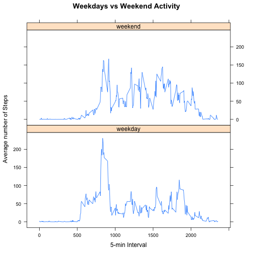

#### Loading and preprocessing the data


```r
activity <- read.csv(unz("RepData_PeerAssessment1/activity.zip",
                         "activity.csv"))
```

#### What is mean total number of steps taken per day?

```r
act.date <- aggregate(activity$steps, list(activity$date), sum)
colnames(act.date) <- c("date","dailySteps") # fix names
# Draw the histogram
hist(act.date$dailySteps, main = "Total Steps Taken Daily",
     xlab = "Number of Steps", col = "lightblue", border = "red")
```

 

```r
mean(act.date$dailySteps, na.rm = T) # get the mean
```

```
## [1] 10766.19
```

```r
median(act.date$dailySteps, na.rm = T) # get the median
```

```
## [1] 10765
```

#### What is the average daily activity pattern?
We will use `aggregate()` with `mean()` as the aggregate function, so we need to
get rid of the missing values, and then `plot()`:

```r
act.clean <- na.omit(activity) # rid of missing values
# New data frame with the mean of the 5-min intervals
act.clean.five <- aggregate(act.clean$steps, list(act.clean$interval), mean)
colnames(act.clean.five) <- c("interval","avgSteps") # fix names
# Plot
plot(act.clean.five, type = "l", col = "red",
     main = "Average Steps on 5-min Intervals")
```

 

This is the 5-min Interval where the highest average number of steps **(206.17 of them)** are taken:

```r
act.clean.five$interval[act.clean.five$avgSteps ==
                          max(act.clean.five$avgSteps)]
```

```
## [1] 835
```

#### Inputting missing values
The number of records with missing values:

```r
length(activity$steps[is.na(activity$steps) == T])
```

```
## [1] 2304
```

We will use the previously created `act.clean.five` that contains the 5-min interval
averages to fill in the missing values

```r
# fixna returns the average step number for a given 5-min interval
fixna <- function(x) act.clean.five$avgSteps[act.clean.five$interval == x]
act2 <- activity # a new frame with the original observations
# Looping over act2 we replace NAs using fixna()
i = 1 # you will always need a counter
while(i <= length(act2$interval)) { 
  if(is.na(act2[i,"steps"])) { # if the number of steps is missing
    act2[i,"steps"] <- fixna(act2[i,"interval"]) # get the corresponding avg
  }
  i = i + 1
}
# I am sure there is a fancy xapply solution to this, but at this stage
#+ beggars can't be choosers...
```

We need to review the original results now that the NAs are gone


```r
act2.clean.date <- aggregate(act2$steps, list(act2$date), sum)
colnames(act2.clean.date) <- c("date","dailySteps") # fix names
# Draw the new histogram
hist(act2.clean.date$dailySteps, main = "Steps Taken per Day (NAs replaced)",
     xlab = "Number of Steps", col = "lightgreen", border = "orange")
```

 

```r
mean(act2.clean.date$dailySteps) # get the new mean
```

```
## [1] 10766.19
```

```r
median(act2.clean.date$dailySteps) # get the new median
```

```
## [1] 10766.19
```

There has been no noticeable change in mean or median by replacing the NAs: expected since we have used mean values as the replacement values. The 3rd quantile has shifted, which is consistent with the apparent overall increase in steps taken. This is evident by looking a the summaries for the daily aggregates as shown below:


```r
sumview <- data.frame(act.date$dailySteps, act2.clean.date$dailySteps) # just the columns of interest
colnames(sumview) <- c("Original Set", "Cleaned up Set")
summary(sumview) # a brief summary
```

```
##   Original Set   Cleaned up Set 
##  Min.   :   41   Min.   :   41  
##  1st Qu.: 8841   1st Qu.: 9819  
##  Median :10765   Median :10766  
##  Mean   :10766   Mean   :10766  
##  3rd Qu.:13294   3rd Qu.:12811  
##  Max.   :21194   Max.   :21194  
##  NA's   :8
```

The total daily numbers of steps have also gone up.

```r
totalDaily <- data.frame(sum(activity$steps, na.rm= T)/nlevels(activity$date),
                         sum(act2$steps)/nlevels(act2$date))
colnames(totalDaily) <- c("daily original mean", "cleaned up mean")
totalDaily
```

```
##   daily original mean cleaned up mean
## 1             9354.23        10766.19
```

#### Are there differences in activity patterns between weekdays and weekends?


```r
act2$wd <- ifelse(!weekdays(as.POSIXlt.date(act2$date))
                             %in% c("Saturday", "Sunday"),"weekday","weekend")
# Aggregate by interval mean
act2.wday <- aggregate(act2$steps[act2$wd == "weekday"],
                       list(act2$interval[act2$wd == "weekday"]), mean)
act2.wend <- aggregate(act2$steps[act2$wd == "weekend"],
                         list(act2$interval[act2$wd == "weekend"]), mean)
colnames(act2.wday) <- c("interval","avgSteps") # fix the names
colnames(act2.wend) <- c("interval","avgSteps")
act2.wday$wd <- "weekday" # add our factors
act2.wend$wd <- "weekend"
act2.all <- rbind(act2.wday, act2.wend) # All Together Now
act2.all$wd <- as.factor(act2.all$wd) # turn into factors
```
After all the prep, we plot the differences using lattice..


```r
# Plot!
library(lattice)
xyplot(avgSteps ~ interval | wd, data = act2.all, type = "l", 
       main = "Weekdays vs Weekend Activity", xlab = "5-min Interval",
       ylab = "Average number of Steps",
       layout=c(1,2))
```

 
